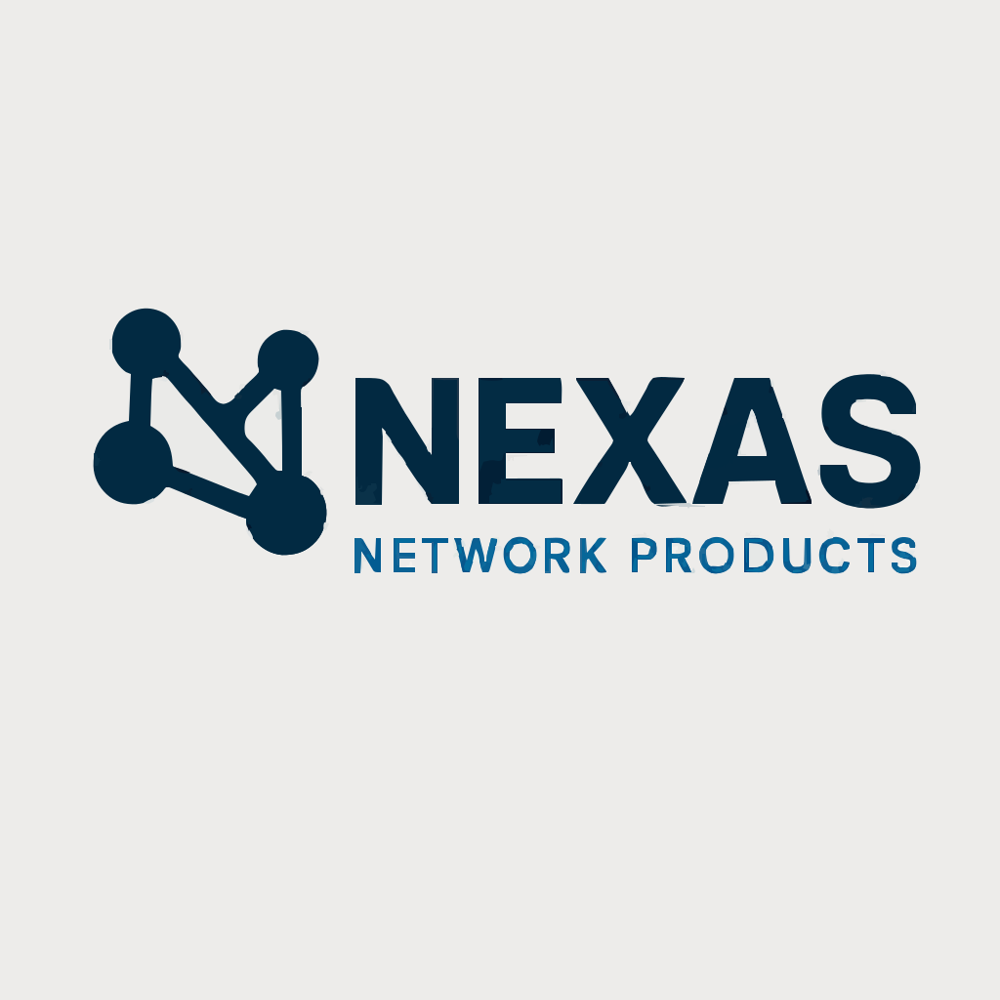

# NexusNetwork - MERN STACK Project

<div align="center">



**A Full-Stack E-Commerce Platform Built with Modern Technologies**

[](https://reactjs.org/)
[](https://vitejs.dev/)
[](https://nodejs.org/)
[](https://mongodb.com/)
[](https://tailwindcss.com/)

</div>

---

## Project Overview

NexusNetwork is a comprehensive full-stack e-commerce platform designed to showcase modern web development practices. This project demonstrates proficiency in building scalable web applications using the MERN stack with additional modern tools and frameworks.

### Key Features

- **Product Catalog** - Browse and search products with advanced filtering
- **User Authentication** - Secure registration and login system
- **Shopping Cart** - Add, remove, and manage cart items
- **Responsive Design** - Mobile-first approach with TailwindCSS
- **Secure Backend** - Express.js with MongoDB integration
- **Fast Performance** - Vite for lightning-fast development and builds
- **Modern UI/UX** - Clean and intuitive user interface

---

## Architecture

```
NexusNetwork/
├── frontend/          # React + Vite + TailwindCSS
│   ├── src/
│   │   ├── components/   # Reusable React components
│   │   ├── assets/       # Static assets
│   │   └── App.jsx       # Main application component
│   ├── public/           # Public assets
│   └── package.json      # Frontend dependencies
│
├── server/            # Node.js + Express + MongoDB
│   ├── models/           # Database models
│   ├── routes/           # API routes
│   ├── server.js         # Main server file
│   └── package.json      # Backend dependencies
│
└── README.md          # Project documentation
```

---

## Technology Stack

### Frontend
- **Framework:** React 19.1.0
- **Build Tool:** Vite 7.0.4
- **Styling:** TailwindCSS 3.4.17
- **HTTP Client:** Axios
- **Development:** ESLint, PostCSS

### Backend
- **Runtime:** Node.js
- **Framework:** Express.js
- **Database:** MongoDB with Mongoose ODM
- **Middleware:** CORS, dotenv
- **Development:** Nodemon

### Development Tools
- **Version Control:** Git
- **Package Manager:** npm
- **Environment:** VS Code
- **API Testing:** Thunder Client / Postman

---

## Quick Start

### Prerequisites
- Node.js (v18 or higher)
- MongoDB (local or Atlas)
- Git

### Installation

1. **Clone the repository**
   ```bash
   git clone <repository-url>
   cd NexusNetwork
   ```

2. **Install Frontend Dependencies**
   ```bash
   cd frontend
   npm install
   ```

3. **Install Backend Dependencies**
   ```bash
   cd ../server
   npm install
   ```

4. **Environment Setup**
   
   Create `.env` files in the server directory:
   ```env
   PORT=5000
   MONGODB_URI=mongodb://localhost:27017/nexusnetwork
   JWT_SECRET=your-secret-key
   ```

5. **Start Development Servers**
   
   **Backend Server:**
   ```bash
   cd server
   npm run dev
   ```
   
   **Frontend Development Server:**
   ```bash
   cd frontend
   npm run dev
   ```

## Application Components

### Frontend Components
- **Home** - Landing page with featured products
- **Product** - Product listing and details
- **Login/Signup** - User authentication forms
- **Contact** - Contact information and form
- **Quality** - Quality assurance and testimonials
- **Navbar** - Navigation component
- **Footer** - Footer with links and information

### Backend Structure
- **Models** - User model with Mongoose schema
- **Routes** - User authentication and management routes
- **Server** - Express server with middleware configuration

---

## Project Goals & Learning Outcomes

### Technical Skills Demonstrated
- Full-stack web development
- RESTful API design and implementation
- Database design and integration
- Modern JavaScript (ES6+)
- React hooks and component lifecycle
- Responsive web design
- Version control with Git
- Project structure and organization

### ECOMMERCE PROJECT  Objectives Met
- Planning - Comprehensive project planning and architecture
- Implementation - Full-stack application development
- Testing - Component and API testing
- Documentation - Comprehensive project documentation
- Collaboration - Version control and project management

---

## Features in Detail

### User Authentication System
- Secure user registration and login
- JWT-based authentication
- Password encryption
- User session management

### Product Management
- Dynamic product display
- Search and filter functionality
- Product categories and sorting
- Responsive product cards

### Modern UI/UX
- Mobile-first responsive design
- Clean and intuitive interface
- Fast loading times with Vite
- Consistent design system with TailwindCSS

---

## Future Enhancements

- Shopping cart functionality
- Payment integration
- Email notifications
- Admin dashboard
- Advanced search features
- Product reviews and ratings
- Progressive Web App (PWA)
- Multi-language support

---

## Contributing

This is an academic project for SGP III.

## License

This project is created for academic purposes as part of SGP III coursework.

## Acknowledgments

- Thanks to the faculty and mentors for guidance
- React, Node.js, and MongoDB communities for excellent documentation
- TailwindCSS for the amazing utility-first CSS framework
- Vite team for the blazing fast build tool

---

<div align="center">

*ECOMMERCE Project - 2025*

</div> 

